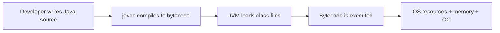

# Java Fundamentals

> Interview Preparation Notes

---

## 1. Overview

Java is a high-level, class-based, object-oriented programming language designed for portability, maintainability, and large-scale software development. It is widely used for backend systems, enterprise applications, Android apps, and distributed services.

The key idea behind Java is platform independence: Java source code is compiled into bytecode, and that bytecode runs on the Java Virtual Machine (JVM), not directly on the operating system. This makes Java a strong choice when code needs to run across different machines with minimal changes.

Java is especially important for developers because it combines strong typing, object-oriented design, a large standard library, and mature ecosystem tooling. In interviews, Java fundamentals are often tested because they form the foundation for OOP, collections, multithreading, JVM, and enterprise Java.

> Related:
>
> - 07-java/02-oop.md
> - 07-java/06-collections.md
> - 07-java/15-jvm-memory.md

---

## 2. Why Do We Need It?

Before Java, many programming languages were tied closely to a specific operating system or hardware architecture. That created friction in enterprise software, where the same application often had to run on different machines and environments.

Java solved this by introducing a common runtime model:

Problem
↓
Platform-specific execution and deployment complexity
↓
Java compiles code to bytecode and runs it on the JVM
↓
Write once, run anywhere

This gave developers several benefits:

- Portability across operating systems
- Stronger developer productivity
- Better standardization for enterprise systems
- A mature ecosystem for backend applications
- Cleaner OOP-based software design

Java is not just a language; it is a runtime model and ecosystem. The JVM handles execution, memory management, and runtime behavior, which makes Java more predictable for large applications.

---

## 3. Core Concepts

### 3.1 Java Language

Java is:

- High-level
- Statically typed
- Object-oriented
- Platform-independent through JVM
- Known for strong type safety and ecosystem maturity

### 3.2 JDK, JRE, and JVM

| Component | Meaning                  | Purpose                                             |
| --------- | ------------------------ | --------------------------------------------------- |
| JDK       | Java Development Kit     | Tools to write, compile, and run Java programs      |
| JRE       | Java Runtime Environment | Environment required to run Java applications       |
| JVM       | Java Virtual Machine     | Executes Java bytecode and manages runtime behavior |

Conceptually:

JDK contains JRE and development tools.
JRE contains JVM and runtime libraries.

### 3.3 Core Java Building Blocks

- Class
- Object
- Method
- Variable
- Constructor
- Package
- Access modifier
- Primitive type
- Reference type

### 3.4 Object-Oriented Principles

Java is built around OOP concepts:

- Encapsulation
- Inheritance
- Polymorphism
- Abstraction

These help create modular, reusable, and maintainable code.

### 3.5 Primitive vs Reference Types

Java has two main categories of data types:

- Primitive types: `int`, `char`, `double`, `boolean`, etc.
- Reference types: objects, arrays, strings, custom classes

Primitive values are stored directly in memory; reference types store pointers to heap objects.

---

## 4. How It Works

Java programs go through a standard lifecycle:

```text
Java source code
   ↓
javac compiler
   ↓
Bytecode (.class)
   ↓
JVM loads classes
   ↓
Bytecode execution
   ↓
Runtime services such as GC, JIT, memory management
```

The simplified flow is:



The JVM is the execution environment that provides portability. It translates bytecode into machine instructions for the host OS. In modern JVMs, this is often optimized using Just-In-Time (JIT) compilation to improve performance.

---

## 5. Syntax / Basic Example

```java
public class Main {
    public static void main(String[] args) {
        int age = 28;
        String name = "Aman";

        System.out.println("Hello, " + name + "! You are " + age + " years old.");
    }
}
```

### Explanation

- `public class Main` defines a class named `Main`.
- `public static void main(String[] args)` is the entry point of the program.
- `System.out.println(...)` prints output to the console.
- `String` is a reference type, while `int` is a primitive type.

Java requires a class-based structure and a `main` method to run a standalone program.

---

## 6. Internal Working

### 6.1 Compilation

Java code is first compiled by the Java compiler (`javac`). The compiler checks syntax and type rules, then produces `.class` files containing bytecode.

This is important because Java is not compiled to native machine code directly.

### 6.2 Class Loading

At runtime, the JVM loads classes as needed. It finds the compiled `.class` file, reads the structure, and initializes the class when required.

### 6.3 Bytecode Execution

Bytecode is a platform-neutral instruction set. The JVM interprets or JIT-compiles it into machine code for the host OS. This is one reason Java can run on Windows, Linux, and macOS without changing source code.

### 6.4 Memory Model

Java uses memory areas such as:

- Stack: method calls, local variables
- Heap: objects and arrays
- Method area: class metadata
- PC register: current instruction tracking
- Native method stack: native code calls

The heap is where most objects live, and the JVM manages this memory through garbage collection.

### 6.5 Garbage Collection

Java automatically manages memory through garbage collection. Objects that are no longer referenced are eligible for collection. This reduces manual memory management bugs like dangling pointers or memory leaks.

However, garbage collection is not free:

- It introduces pauses in some workloads
- It depends on heap size and object creation patterns
- Poorly designed object lifecycles can still cause memory issues

### 6.6 JIT Compilation

The JVM often uses JIT compilation to optimize frequently executed bytecode. This helps Java perform well in production while still maintaining portability.

---

## 7. Important Concepts

### 7.1 Variables

Java variables must have a type:

```java
int count = 10;
String name = "Java";
double price = 99.99;
```

Java is statically typed, which means type checking happens during compilation.

### 7.2 Methods

Methods define behavior. They can return values or be `void`:

```java
public int add(int a, int b) {
    return a + b;
}
```

### 7.3 `static`

The `static` keyword means the member belongs to the class, not an instance of the class.

```java
public class MathUtils {
    public static int square(int n) {
        return n * n;
    }
}
```

This is useful for utility methods and constants.

### 7.4 Access Modifiers

Java provides access control:

- `public`: accessible everywhere
- `private`: accessible only inside the class
- `protected`: accessible within package and subclasses
- default (package-private): accessible within same package

### 7.5 `final`

`final` means a value cannot change after initialization.

- Final variable: constant-like
- Final method: cannot be overridden
- Final class: cannot be subclassed

### 7.6 Primitive vs Reference Comparison

```java
int a = 10;
int b = 10;
System.out.println(a == b); // true

String s1 = new String("Java");
String s2 = new String("Java");
System.out.println(s1 == s2); // false
System.out.println(s1.equals(s2)); // true
```

This is an important interview topic: `==` compares references for objects, while `equals()` compares value/content.

---

## 8. Real-World Usage

Java is used in many production systems:

- Enterprise backend applications
- Banking and fintech systems
- E-commerce platforms
- Payment processing systems
- REST APIs with Spring Boot
- Big data and distributed processing tools
- Android application development
- Large-scale microservice systems

In production, Java is chosen for reliability, performance, ecosystem maturity, and strong tooling support. Many large companies rely on Java for systems that need long uptime and predictable behavior.

For example, a banking API may use Java for:

- Request validation
- Business rule enforcement
- Database access
- Transactions
- Security control
- Logging and auditing

The language itself is not only about syntax; it is about building maintainable, scalable enterprise systems.

---

## 9. Best Practices

- Prefer meaningful class and variable names.
- Keep classes small and focused on a single responsibility.
- Use `final` for immutable values when appropriate.
- Prefer `equals()` for object value comparison rather than `==`.
- Avoid unnecessary object creation in hot paths.
- Use proper exception handling instead of swallowing errors.
- Keep configuration and environment-specific values externalized.
- Understand the JVM memory model before optimizing performance.

---

## 10. Common Mistakes

### 1. Confusing `==` with `equals()`

This is one of the most common Java interview traps. `==` checks reference equality, not logical equality.

### 2. Ignoring primitive vs reference behavior

Developers sometimes assume all data types behave the same way. They do not.

### 3. Overusing `static`

Static members are useful, but overusing them can make code harder to test and maintain.

### 4. Creating unnecessary objects

Frequent object creation can increase heap pressure and garbage collection overhead.

### 5. Not understanding the role of the JVM

Java is not just syntax. Runtime behavior, memory model, and performance are critical.

### 6. Writing code without considering exceptions

Unchecked and checked exceptions must be handled thoughtfully. Poor error handling leads to unstable systems.

---

## 11. Common Differences

| Concept                                   | Java behavior                                                 | Why it matters                           |
| ----------------------------------------- | ------------------------------------------------------------- | ---------------------------------------- |
| Primitive vs Reference                    | Primitives store values directly; references point to objects | Affects memory and comparison            |
| `==` vs `equals()`                        | `==` compares references; `equals()` compares contents        | Common source of bugs                    |
| JDK vs JRE                                | JDK includes tools; JRE is runtime                            | Helps understand setup and deployment    |
| Compile-time vs runtime                   | Type checking happens before execution                        | Improves correctness and maintainability |
| Object-oriented design vs procedural code | Java encourages classes and objects                           | Enables modular, testable systems        |

---

## 12. Interview Questions

### Beginner

#### Q1. What is Java?

**Answer:**

Java is a high-level, object-oriented, class-based language that is designed to be platform-independent through the JVM. It is commonly used to build backend systems, enterprise software, and Android applications.

#### Q2. What is the difference between JDK, JRE, and JVM?

**Answer:**

The JDK is used for development and includes tools like the compiler. The JRE is the runtime environment needed to run Java programs. The JVM is the engine that executes Java bytecode and manages runtime behavior such as memory and garbage collection.

#### Q3. Why is Java platform independent?

**Answer:**

Java source code is compiled into bytecode, not directly into machine code. That bytecode runs on the JVM, which is implemented for multiple operating systems. This is the reason Java follows the Write Once, Run Anywhere model.

---

### Intermediate

#### Q4. What is the difference between `int` and `Integer`?

**Answer:**

`int` is a primitive type, while `Integer` is a wrapper class. Primitive types are stored directly in memory and are faster for simple values. Wrapper classes allow primitives to be used in contexts that require objects, such as collections.

#### Q5. What is the difference between `==` and `.equals()` in Java?

**Answer:**

`==` compares references for objects and values for primitive types. `.equals()` compares the content or logical value of an object. For strings, `equals()` is usually the correct comparison method because two different string objects may contain the same text.

#### Q6. What is the purpose of the `main` method?

**Answer:**

The `main` method is the entry point of a Java application. When a Java program starts, the JVM looks for a method with the signature `public static void main(String[] args)` and begins execution there.

---

### Advanced

#### Q7. How does Java achieve platform independence?

**Answer:**

Java source is compiled into platform-neutral bytecode. The JVM then translates or optimizes that bytecode for the target machine at runtime. This separation between source code, bytecode, and runtime environment allows the same Java program to run on different operating systems with compatible JVM implementations.

#### Q8. What happens internally when a Java program starts?

**Answer:**

The JVM loads the class files, verifies their structure, initializes the required classes, allocates memory, executes the `main` method, and manages runtime resources such as garbage collection. JIT compilation may optimize hot code paths for better performance.

#### Q9. Why is garbage collection important in Java?

**Answer:**

Garbage collection automates memory reclamation so developers do not need to manually free memory. This reduces common memory-related bugs and makes application development safer. At the same time, GC behavior affects performance, so developers still need to be mindful of object creation and memory usage.

---

### Follow-Up Questions

#### Q10. Why is Java considered safer than C/C++ in memory management?

**Answer:**

Java reduces direct memory-management burden by handling object lifecycle through garbage collection and enforcing stronger type checks. This lowers the risk of pointer misuse, memory corruption, and many common low-level bugs.

#### Q11. When would you prefer Java over a more lightweight language?

**Answer:**

Java is preferred when large-scale enterprise systems, team collaboration, maintainability, and long-term runtime stability matter more than minimal runtime overhead. It is especially strong when building backend applications with many developers and long-lived deployment cycles.

---

## 13. Scenario-Based Questions

### Scenario 1 — A Java app is running slowly

Your application becomes slower after a few hours of operation. What would you inspect first?

### Approach

1. Check heap usage and garbage collection logs.
2. Review whether too many temporary objects are being created.
3. Look for memory leaks or long-lived references.
4. Measure CPU hotspots and JIT optimization behavior.
5. Check database queries and network calls, since many performance issues are external to Java itself.

### Key point

Java performance is not only about code syntax; runtime behavior, memory allocation, and GC frequently matter more than raw algorithm complexity in the first few layers of debugging.

### Scenario 2 — A developer compares two Strings using `==`

A candidate writes:

```java
String a = new String("Java");
String b = new String("Java");

if (a == b) {
    System.out.println("Equal");
}
```

What is the issue?

### Approach

Two different objects can contain the same text but still be different references. The correct comparison is usually:

```java
if (a.equals(b)) {
    System.out.println("Equal");
}
```

This is a classic Java interview scenario and a common production bug.

---

## 14. Practical Examples

### Example 1: Basic Class and Object

```java
class Employee {
    private String name;
    private int id;

    public Employee(String name, int id) {
        this.name = name;
        this.id = id;
    }

    public void display() {
        System.out.println("Employee: " + name + ", ID: " + id);
    }
}

public class Main {
    public static void main(String[] args) {
        Employee e = new Employee("Aman", 101);
        e.display();
    }
}
```

### Example 2: Primitive vs Reference

```java
public class Main {
    public static void main(String[] args) {
        int x = 5;
        int y = 5;

        System.out.println(x == y); // true

        String s1 = new String("Java");
        String s2 = new String("Java");

        System.out.println(s1 == s2); // false
        System.out.println(s1.equals(s2)); // true
    }
}
```

These examples show why Java fundamentals are important in both daily coding and interviews.

---

## 15. Quick Revision

- Java is a high-level, object-oriented language.
- Java source is compiled to bytecode.
- The JVM executes bytecode on different operating systems.
- JDK is for development, JRE is for running apps, JVM executes code.
- Java is statically typed.
- `==` compares primitive values or object references; `equals()` compares object content.
- Java uses automatic garbage collection.
- Object-oriented fundamentals include encapsulation, inheritance, abstraction, and polymorphism.

---

## 16. Interview Cheat Sheet

| Question                                | Remember                                         |
| --------------------------------------- | ------------------------------------------------ |
| What is Java?                           | High-level, object-oriented, portable language   |
| Why is Java portable?                   | Bytecode runs on the JVM                         |
| JDK vs JRE vs JVM                       | Tools vs runtime vs execution engine             |
| Why is `equals()` important?            | It compares logical values, not just references  |
| Why does Java use GC?                   | Simplifies memory management                     |
| What is the `main` method?              | Program entry point                              |
| Why is Java used in enterprise systems? | Stability, tooling, maintainability, portability |

---

> Related:
>
> - 07-java/02-oop.md
> - 07-java/06-collections.md
> - 07-java/15-jvm-memory.md
